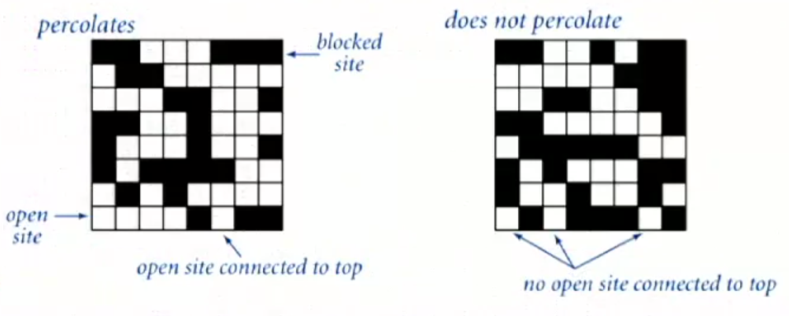
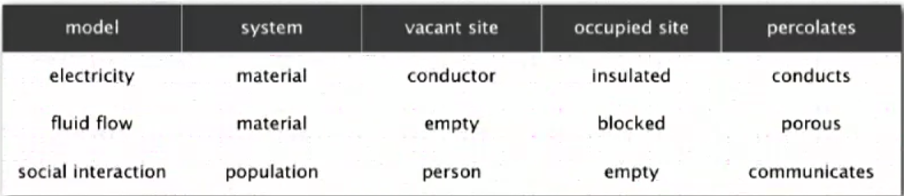

# Dynamic Connectivity

Given a set of N objects. Use the Union command to connect two objects and the
Find/Connected query to check if those two objects are connected.

- Union Command: Connect two objects
- Find/Connected query: is there a path connecting the two objects?

Model of objects:
`[0,1,2,3,4,5,6,7,8,9]`

It's more convenient to name objects 0 to n-1

- use integers as array index
- suppress details not relevant to union find

We assume "is connected to" is an equivalence relation:

- Reflexive: p is connected to p
- Symmetric: if p is connected to q, then q is connected to p
- Transitive: if p is connected to q and q is connected to r, then p is
  connected to r

Connected components: Maximal set of objects that are mutually connected

ex:

```
0    1    2 -- 3
   /      |  / |
4 -- 5    6    7
```

3 connected components
{0} {1,4,5} {2,3,6,7}

Implementing the operations

- Find query: check if two objects are in the same component
- Union command: replace components containing two objects with their union

If a union command is called on the example numbers union(2,5) then
we need to combine the set of connected components.

From: {0} {1,4,5} {2,3,6,7}\
To: {0} {1,2,3,4,5,6,7}

Goal: Design efficient data structure for union-find

- Number of objects N can be huge
- Number of operations M can be huge
- Find queries and union commands may be intermixed

Example of Data structure

Public class UF:

- UF(int N): initialize union-find data structure with N objects(0 to n-1)
- void union(int p, int q) add connection between p and q
- boolean connected(int p, int q): are p and q in the same component
- int find(int p): component identifier for p(0 to n-1)
- int count(): number of components

Dynamic-connectivity client

- Read in number of objects N from standard input
- Repeat:
    - read in pair of integers from standard input
    - if they are not yet connected, connect them and print out pair

ex.txt

```
10
4 3
3 8
6 5
9 4
2 1
// 8 9
5 0
7 2
6 1
// 1 0
// 6 7
```

```Java
public class Main {
    public static void main(String[] args) {
        int N = StdIn.readInt();
        UF uf = new UF(n);
        while (!StdIn.isEmpty()) {
            int p = StdIn.readInt();
            int q = StdIn.readInt();
            if (!uf.connected(p, q)) {
                uf.union(p, q);
                System.out.println(p + " " + q);
            }
        }
    }
}
```

## Quick-find [eager approach] - array

Data structure:
- integer array `id[]` of size N
- interpretation: p and q are connected if and only if they have the same id

`nums 0 1 2 3 4 5 6 7 8 9`

`id[] 0 1 1 8 8 0 0 1 8 8`

```
0    1 -- 2    3 -- 4
|         |    |    |
5 -- 6    7    8    9
```
- 0,5, and 6 are connected
- 1,2, and 7 are connected
- 3,4,8, and 9 are connected

Find: check if p and q have the same id

id[6] = 0; id[1] = 1\
6 and 1 are not connected

union: to merge components containing p and q, 
change all entries whose id equals id[p] to id[q]

From:

`nums 0 1 2 3 4 5 6 7 8 9`

`id[] 0 1 1 8 8 0 0 1 8 8`

To:

`nums 0 1 2 3 4 5 6 7 8 9`

`id[] 1 1 1 8 8 1 1 1 8 8`

### Algorithm code [eager approach]

```Java
public class UF {
    private int[] id;

    public UF(int N) {
        id = new int[N];
        for (int i = 0; i < N; i++) {
            id[i] = i; // set id of each object to itself
        }
    }
    
    public boolean connected(int p, int q) {
        return id[p] == id[q]; // check if p and q are the same
    }
    
    public void union(int p, int q) {
        int pid = id[p];
        int qid = id[q];
        for (int i = 0; i < id.length; i++) {
            if(id[i] == pid) id[i] = qid;
        } // change all entries with id[p] to id[q]
    }
    
}
```

## Quick-find [eager approach] is too slow

cost model: number of array accesses (for read and write)

order of growth of number of array accesses
```
algorithm   |  initialize  |  union  |  find
quick-find  |      N       |    N    |   1
```

quick-find defect - union too expensive

Ex: Takes `N^2 - quadratic` array accesses to process sequence 
of N union commands on N objects

`Quadratic time is much too slow for large problems`
- they don't scale
- get slower as computers get faster

### Quadratic algorithms do not scale

Rough standard 
- 10^9 operations per second
- 10^9 words of main memory
- touch all words in approximately 1 second
- ^ true since around 1950

Problem for quick find
- 10^9 union commands on 10^9 objects
- quick-find takes more than 10^18 operations
- 30+ years of computer time!

quadratic algorithms don't scale with tech
- new computer may be 10x as fast
- but, has 10x as much memory => want to solve a problem that is 10x as big
- with quadratic algorithm, takes 10x as long

## Quick-union [lazy approach] - tree

Data structure
- integer array `id[]` of size N
- similar to eager approach and grows in linear time
- interpretation: `id[i]` is parent of i
- root of i is `id[id[id[...id[i]...]]]` < can be seen as a tree or tree root \
keeps going until it doesn't change.

`nums 0 1 2 3 4 5 6 7 8 9`

`id[] 0 1 9 4 9 6 6 7 8 9`

```
0 1  9   6 7 8 
    /\   |
   2  4  5
      |
      3
```

union: to merge components containing p and q, set the id of p's root to the 
id of q's root

```
           p   q
nums 0 1 2 3 4 5 6 7 8 9 objects
id[] 0 1 9 4 9 6 6 7 8 6 < - only one value changes | roots
```

```
0 1      6 7 8 
       / |
      9  5
     /\
    2 4
      |
      3
```

### Algorithm code [lazy approach]

```Java
public class UF {
    private int[] id;

    public UF(int N) {
        id = new int[N];
        for (int i = 0; i < N; i++) {
            id[i] = i; // set id of each object to itself
        }
    }
    
    private int root(int i) {
        while(i != id[i]) {
            i = id[i];
        }
        return i;
    } // chase parent pointers until reach root
    
    public boolean connected(int p, int q) {
        return root[p] == root[q]; // check if p and q have the same root
    }
    
    public void union(int p, int q) {
        int i = root(p);
        int j = root(q);
        id[i] = j;
    }
    
}
```

## Quick-find [lazy approach] is too slow

cost model: number of array accesses (for read and write)

order of growth of number of array accesses
```
algorithm   |  initialize  |  union  |  find
quick-find  |      N       |    N    |   1
quick-union |      N       |    N    |   N   <- worst case 
```

quick-find defect
- union too expensive (N array accesses)
- trees are flat, but too expensive to keep them flat

quick-union defect
- trees can get tall
- find too expensive (could be N array accesses)

## Quick-union improvement 1: weighting

weighted quick-union
- modify quick-union to avoid tall trees
- keep track of siz of each tree (number of objects)
- balance by linking root of smaller tree to root of larger tree
- alternative names: union by height or "rank"

```
quick-union - puts the larger tree lower
            q
        / smaller tree
      p
 larger tree
 
weighted - always chooses the better alternative
         p
larger tree \
             q
        smaller tree
```

### Algorithm code - weighting

Data structure - same as quick-union, but maintain extra array sz[i] to 
count number of objects in the tree rooted at i

Find - identical to quick-union
- return root(p) == root(q);

union - modify quick-union to:
- link root of smaller tree to root of larger tree
- update the sz[] array: gives the number of objects in the tree rooted at i

```
int i = root(p);
int j = root(q);

if(i == j) return;
if(sz[i] < sz[j]) {
  id[i] = j; 
  sz[j] += sz[i];
} else {
  id[j] = i; sz[i] += sz[j];
}
```

```Java
public class UF {
    private int[] id;

    public UF(int N) {
        id = new int[N];
        for (int i = 0; i < N; i++) {
            id[i] = i; // set id of each object to itself
        }
    }
    
    private int root(int i) {
        while(i != id[i]) {
            i = id[i];
        }
        return i;
    } // chase parent pointers until reach root
    
    public boolean connected(int p, int q) {
        return root[p] == root[q]; // check if p and q have the same root
    }
    
    public void union(int p, int q) {
        int i = root(p);
        int j = root(q);
        id[i] = j;
    }
    
}
```

### Weighted quick-union analysis

Running time
- Find: takes time proportional to depth of p and q
- Union: takes constant time, given roots

Proposition - depth of any node x is at most lg N. lg = base-2 logarithm
- N = 10
- depth(x) = 3 * lg N

Proof - when does depth of x increase?
- increases by 1 when tree T1 containing x is merged into another tree T2
- the size of the tree containing x at least doubles since | T2| >= | T1|
- size of tree containing x can double at most lg N times. why?

order of growth of number of array accesses
```
algorithm   |  initialize  |  union  |  find
quick-find  |      N       |    N    |   1
quick-union |      N       |    N    |   N   <- worst case 
weighted QU |      N       |  lg N   | lg N
```

Q - stop at guaranteed acceptable performance?
A - No, easy to improve further

## Path Compression Improvement 2

Quick union with path compression - just after computing the root of p
set the id of each examined node to point to that root

### Algorithm code - path compression

Two-pass implementation - add second loop to root() to set the id[] of each
examined node to the root

Simpler one-pass variant - make every other node in path point to it's 
grandparent (thereby halving path length)

```
private int root(int i) {
  while(i != id[i]) {
    id[i] = id[id[i]]; // extra line of code for improvment
    i = id[i];
  }
  return i;
}
```

in practice - non reason not to! keeps tree almost completely flat

### Weighted quick-union with path compression: amortized analysis

Proposition - starting from an empty data structure, any sequence of M union
-find ops on N objects makes <= c(N + M lg * N) array accesses.
- analysis can be improved to N + M a(M,N) 
- simple algorithm with fascinating mathematics

Iterate log function
```
     N | lg*N  
     1 |  0
     2 |  1
     4 |  2
     16|  3
  65536|  4
2^65536|  5
```

Linear-time algorithm for M union-find ops on N objects?
- cost within constant factor of reading in the data
- in theory, WQUPC is not quite linear
- in practice, WQUPC is linear

## Union-find applications

- percolation
- games (Go, Hex)
- Dynamic connectivity
- least common ancestor
- equivalence of finite state automata
- hoshen-kopelman algorithm in physics
- hinley-milner polymorphic type inference
- kruskal's minimum spanning tree algorithm
- compiling equivalence statements in fortran
- morphological attribute openings and closing
- matlabs bwlabel() function in image processing

## percolation

A model for many physical systems:
- N-by-N grid of sites
- each site is open with probability p(or blocked with probability 1-p)
- System percolates iff top and bottom are connected by open sites



Percolation Examples

